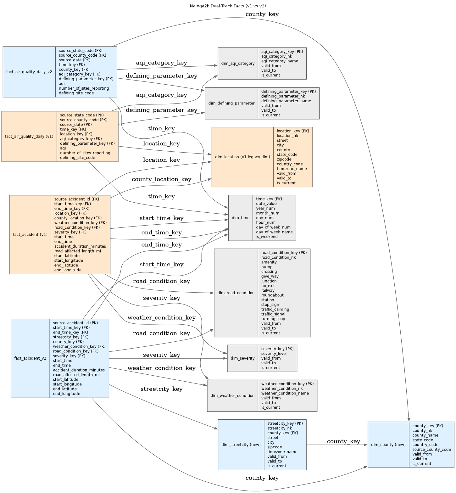

# 4-pikp Data Warehousing Project

This repository contains coursework-focused data warehousing assets, including:

- dimensional modeling and schema documentation,
- ETL scripts for US-Accidents and EPA AQS datasets,
- containerized local infrastructure under `infra/`.



## Environment Assumptions

For reproducibility, current project work assumes:

- OS: Fedora Linux 43 (`Fedora release 43 (Forty Three)`)
- Container runtime:
  - Docker Engine `29.2.1`
  - Docker Compose plugin `v2.27.0`
- Python environment manager: Conda `25.11.0`
- Python runtime for project scripts: `Python 3.12.2` in Conda env `conda_py_env_312`
- Shell: Bash `5.3.0`
- SELinux status/config: enabled and enforcing (targeted policy)
- Host has sufficient free disk for large raw datasets and PostgreSQL container volumes
- Host has network access for initial image pulls and external dataset/repo operations

If you run this project in a different environment, adjust local tooling and script execution accordingly.

## Acquiring raw data

Coming soon.

## Repository Orientation

### Top-level layout

- `docs/`
  - project documentation, ETL notes, analysis outputs (`analysis.json`, validation report), and diagrams (`docs/img/`).
  - execution logs are written to `docs/logs/`.
- `infra/`
  - local infrastructure definitions.
  - `infra/compose/compose.yml` and env example for container runtime.
  - `infra/platform/postgres/init/` bootstrap SQL.
  - optional Pentaho/WebSpoon workspace under `infra/platform/pentaho/`.
  - note: Pentaho artifacts are retained in-repo, but current ETL implementation uses SQL + Python; see [`docs/etl.md`](docs/etl.md) for rationale and migration strategy.
- `scripts/`
  - operational entry points and ETL/analysis automation.
  - `scripts/etl/`: dimension/fact loaders (v1 and v2), orchestrators, integrity checks.
  - `scripts/analysis/`: raw-data analysis and DB-vs-analysis validation.
  - `scripts/gh/`: GitHub policy/admin helper scripts.
  - root `scripts/*.sh`: infra lifecycle, PostgreSQL helper commands, full-cycle runners.
- `raw/`
  - source input datasets (kept out of git except `.gitkeep`).
- `data/`
  - runtime/persisted local data (for example PostgreSQL volume data), not committed except `.gitkeep`.
- `.github/workflows/`
  - repository automation policies (including external PR auto-close workflow).
- `naloga1/`
  - initial proposal/submission artifacts.
- `naloga2/`
  - baseline star schema assets and source mapping docs.
- `naloga2b/`
  - v2 dual-track architecture contract, schemas, migration, and datasource docs.
- `naloga3/`, `naloga4/`, `naloga5/`
  - coursework compliance folders, mostly copied/adapted artifacts from authoritative project locations (primarily `scripts/etl/` and `naloga2b/`).

### Notes on `naloga*` folders

- `naloga1`, `naloga2`, and `naloga2b` contain primary project assets.
- `naloga3` to `naloga5` are mostly compliance packaging for assignment delivery.

## Running the project in one go

Use the full-cycle runner for legacy end-to-end flow (clear DW, run analysis, run v1 ETL, validate):

```bash
./scripts/run-full-etl-cycle.sh
```

Detailed usage:
- Analysis usage: [`scripts/analysis/USAGE.md`](scripts/analysis/USAGE.md)
- ETL usage: [`scripts/etl/USAGE.md`](scripts/etl/USAGE.md)

All processing logs are captured and persisted under `docs/logs/`.

## Running the project step by step

Use the dedicated usage guides for explicit script-by-script execution:

- Analysis usage (raw analysis + DB validation):
  - [`scripts/analysis/USAGE.md`](scripts/analysis/USAGE.md)
- ETL usage (v1 runners, v2 runners, integrity checks, low-level loaders):
  - [`scripts/etl/USAGE.md`](scripts/etl/USAGE.md)

All processing logs are captured and persisted under `docs/logs/`.

## Contribution Policy

This repository is maintained by the owner only.

- External users may clone/read/fork the repository.
- Pull requests from non-collaborators are closed automatically by policy.
- Collaborator/owner pull requests remain allowed.
