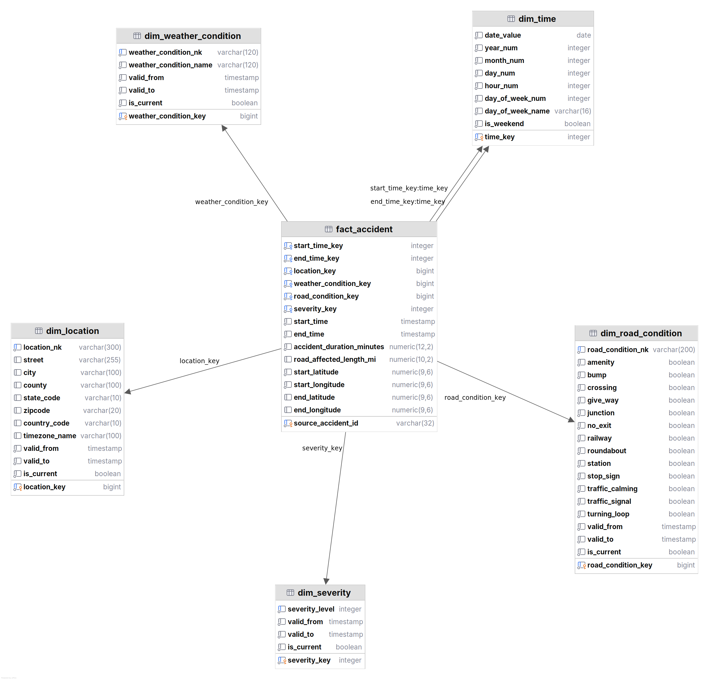

# US-Accidents Datasource Profile (Source 1)

## Source
- Dataset: `US-Accidents: A Countrywide Traffic Accident Dataset`
- Primary URL: https://www.kaggle.com/datasets/sobhanmoosavi/us-accidents
- Reference schema/attribute descriptions: https://smoosavi.org/datasets/us_accidents
- Units convention for this project: **keep original American units** (`mi`, `F`, `in`, `mph`).

## Star Schema Diagram

## Original Source Fields
Below is the complete source column list used in the original/official schema (47 fields), plus `Source` which appears in newer Kaggle releases (48th field):

- `ID`: Unique accident identifier.
- `Source`: Data source provider (present in newer Kaggle versions).
- `Severity`: Accident severity level (1-4).
- `Start_Time`: Local start timestamp.
- `End_Time`: Local end timestamp.
- `Start_Lat`: Start latitude.
- `Start_Lng`: Start longitude.
- `End_Lat`: End latitude.
- `End_Lng`: End longitude.
- `Distance(mi)`: Road distance affected (miles).
- `Description`: Natural-language event description.
- `Number`: Street number.
- `Street`: Street name.
- `Side`: Side of street (L/R).
- `City`: City.
- `County`: County.
- `State`: State code.
- `Zipcode`: ZIP/postal code.
- `Country`: Country code.
- `Timezone`: Time zone string.
- `Airport_Code`: Closest weather station/airport code.
- `Weather_Timestamp`: Weather observation timestamp.
- `Temperature(F)`: Temperature (Fahrenheit).
- `Wind_Chill(F)`: Wind chill (Fahrenheit).
- `Humidity(%)`: Relative humidity (%).
- `Pressure(in)`: Air pressure (inches).
- `Visibility(mi)`: Visibility (miles).
- `Wind_Direction`: Wind direction.
- `Wind_Speed(mph)`: Wind speed (mph).
- `Precipitation(in)`: Precipitation (inches).
- `Weather_Condition`: Weather condition text label.
- `Amenity`: Nearby amenity flag.
- `Bump`: Speed bump/road bump flag.
- `Crossing`: Crossing flag.
- `Give_Way`: Give-way/yield flag.
- `Junction`: Junction/interchange flag.
- `No_Exit`: No-exit flag.
- `Railway`: Railway crossing flag.
- `Roundabout`: Roundabout flag.
- `Station`: Station flag.
- `Stop`: Stop sign flag.
- `Traffic_Calming`: Traffic calming device flag.
- `Traffic_Signal`: Traffic signal flag.
- `Turning_Loop`: Turning loop flag.
- `Sunrise_Sunset`: Day/Night based on sunrise-sunset.
- `Civil_Twilight`: Civil twilight day/night.
- `Nautical_Twilight`: Nautical twilight day/night.
- `Astronomical_Twilight`: Astronomical twilight day/night.

## Star Model Scope
- Business process: traffic accidents and their impact span.
- Fact grain: **one row per accident record** (`ID`) from the source.
- Target style: star schema in PostgreSQL (used as a data-warehouse-like store).

## Required Measures (from your specification)
- `start_time` (from `Start_Time`)
- `end_time` (from `End_Time`)
- `accident_duration_minutes` (`End_Time - Start_Time`)
- `road_affected_length_mi` (from `Distance(mi)`)
- `start_coordinates` (`Start_Lat`, `Start_Lng`)
- `end_coordinates` (`End_Lat`, `End_Lng`)

## Dimensions (from your specification)
- Time
- Location
- Weather conditions
- Road conditions
- Severity

## Decision Log

| Decision | Value | Why |
|---|---|---|
| Units | Keep US units (`mi`, `F`, `in`, `mph`) | Aligns with original dataset and avoids conversion ambiguity in this phase. |
| SCD strategy | Type 2 for dimensions | Preserve historical versions of dimensional values and enable time-correct analysis. |
| Time modeling | Single role-playing `dim_time`, hour grain | Supports both `Start_Time` and `End_Time` with separate FK columns and consistent hourly bucketing. |
| Timestamp precision placement | Keep precise timestamps in fact, not in `dim_time` | Avoid redundant timestamp storage in time dimension while preserving exact event times. |
| Fact grain | One row per source accident (`ID`) | Matches source event granularity and avoids accidental aggregation during load. |

### SCD Options Considered

| Option | Description | Pros | Cons | Decision |
|---|---|---|---|---|
| Type 1 | Overwrite dimension values in place (no history). | Simpler ETL and smaller dimensions. | Loses historical context; past facts reflect newest dimension values. | Not selected |
| Type 2 | Insert new dimension row version, preserve old versions with validity dates. | Keeps historical accuracy and time-correct reporting. | More complex ETL and larger dimensions. | Selected |

## Glossary

| Abbreviation | Meaning |
|---|---|
| `nk` | Natural key (business key). |
| `SCD` | Slowly changing dimension. |
| `FK` | Foreign key. |
| `PK` | Primary key. |

## Type 2 Versioning Rule

- For one business identifier (typically `*_nk`; for severity `severity_level`), dimensions may contain multiple version rows.
- Each version row has a different surrogate key (`*_key`).
- `valid_from` and `valid_to` define the time interval when that version is valid.
- `is_current = true` marks the latest active version for that business identifier.
- New version process: close old row (`valid_to`, `is_current = false`) and insert new current row.
- Note: `dim_time` is static (non-SCD / Type 0); Type 2 applies to the other dimensions.

## Source-to-Star Mapping (Detailed)

### Legend
- `Original`: copied from source column(s) without semantic transformation.
- `Derived`: computed/transformed from one or more source columns.
- `Logistical`: warehouse technical fields (surrogate keys, NK, SCD2 metadata, FK).

### `dw.dim_time`
| Star column | Type | Source field(s) | Mapping / rule |
|---|---|---|---|
| `time_key` | Logistical | `Start_Time` or `End_Time` | Surrogate dimension key generated in DW load; currently implemented as smart key `YYYYMMDDHH` (hour grain). |
| `date_value` | Derived | `Start_Time` or `End_Time` | Date part from timestamp. |
| `year_num` | Derived | `Start_Time` or `End_Time` | `EXTRACT(YEAR ...)`. |
| `month_num` | Derived | `Start_Time` or `End_Time` | `EXTRACT(MONTH ...)`. |
| `day_num` | Derived | `Start_Time` or `End_Time` | `EXTRACT(DAY ...)`. |
| `hour_num` | Derived | `Start_Time` or `End_Time` | `EXTRACT(HOUR ...)`. |
| `day_of_week_num` | Derived | `Start_Time` or `End_Time` | `EXTRACT(DOW ...)`. |
| `day_of_week_name` | Derived | `Start_Time` or `End_Time` | Day name from timestamp. |
| `is_weekend` | Derived | `Start_Time` or `End_Time` | True if DOW in weekend set. |

### `dw.dim_location`
| Star column | Type | Source field(s) | Mapping / rule |
|---|---|---|---|
| `location_key` | Logistical | N/A | Surrogate key (identity). |
| `location_nk` | Logistical | `Street`, `City`, `County`, `State`, `Zipcode`, `Country`, `Timezone` | Stable business key generated by ETL (e.g., concatenated/hash canonicalized values). |
| `street` | Original | `Street` | Direct map. |
| `city` | Original | `City` | Direct map. |
| `county` | Original | `County` | Direct map. |
| `state_code` | Original | `State` | Direct map. |
| `zipcode` | Original | `Zipcode` | Direct map. |
| `country_code` | Original | `Country` | Direct map. |
| `timezone_name` | Original | `Timezone` | Direct map. |
| `valid_from` | Logistical | Load timestamp / event time policy | SCD2 start validity. |
| `valid_to` | Logistical | Load timestamp / event time policy | SCD2 end validity (`9999-12-31 23:59:59` for current). |
| `is_current` | Logistical | N/A | SCD2 current-row flag. |

### `dw.dim_weather_condition`
| Star column | Type | Source field(s) | Mapping / rule |
|---|---|---|---|
| `weather_condition_key` | Logistical | N/A | Surrogate key (identity). |
| `weather_condition_nk` | Logistical | `Weather_Condition` | Stable natural key from canonical weather label. |
| `weather_condition_name` | Original | `Weather_Condition` | Direct map (trim/normalize whitespace in ETL if needed). |
| `valid_from` | Logistical | Load timestamp / event time policy | SCD2 start validity. |
| `valid_to` | Logistical | Load timestamp / event time policy | SCD2 end validity. |
| `is_current` | Logistical | N/A | SCD2 current-row flag. |

### `dw.dim_road_condition`
| Star column | Type | Source field(s) | Mapping / rule |
|---|---|---|---|
| `road_condition_key` | Logistical | N/A | Surrogate key (identity). |
| `road_condition_nk` | Logistical | `Amenity`, `Bump`, `Crossing`, `Give_Way`, `Junction`, `No_Exit`, `Railway`, `Roundabout`, `Station`, `Stop`, `Traffic_Calming`, `Traffic_Signal`, `Turning_Loop` | Stable key from canonical combination of road-feature flags. |
| `amenity` | Original | `Amenity` | Direct boolean map. |
| `bump` | Original | `Bump` | Direct boolean map. |
| `crossing` | Original | `Crossing` | Direct boolean map. |
| `give_way` | Original | `Give_Way` | Direct boolean map. |
| `junction` | Original | `Junction` | Direct boolean map. |
| `no_exit` | Original | `No_Exit` | Direct boolean map. |
| `railway` | Original | `Railway` | Direct boolean map. |
| `roundabout` | Original | `Roundabout` | Direct boolean map. |
| `station` | Original | `Station` | Direct boolean map. |
| `stop_sign` | Derived | `Stop` | Renamed from source to avoid SQL keyword ambiguity. |
| `traffic_calming` | Original | `Traffic_Calming` | Direct boolean map. |
| `traffic_signal` | Original | `Traffic_Signal` | Direct boolean map. |
| `turning_loop` | Original | `Turning_Loop` | Direct boolean map. |
| `valid_from` | Logistical | Load timestamp / event time policy | SCD2 start validity. |
| `valid_to` | Logistical | Load timestamp / event time policy | SCD2 end validity. |
| `is_current` | Logistical | N/A | SCD2 current-row flag. |

### `dw.dim_severity`
| Star column | Type | Source field(s) | Mapping / rule |
|---|---|---|---|
| `severity_key` | Logistical | N/A | Surrogate key used by fact FK (currently integer PK). |
| `severity_level` | Original | `Severity` | Direct map from source. |
| `valid_from` | Logistical | Load timestamp / event time policy | SCD2 start validity. |
| `valid_to` | Logistical | Load timestamp / event time policy | SCD2 end validity. |
| `is_current` | Logistical | N/A | SCD2 current-row flag. |

### `dw.fact_accident`
| Star column | Type | Source field(s) | Mapping / rule |
|---|---|---|---|
| `source_accident_id` | Original | `ID` | Source natural key copied into fact and used as fact table primary key. |
| `start_time_key` | Logistical | `Start_Time` | FK to `dim_time.time_key` using hour bucket of start time. |
| `end_time_key` | Logistical | `End_Time` | FK to `dim_time.time_key` using hour bucket of end time. |
| `location_key` | Logistical | `Street`, `City`, `County`, `State`, `Zipcode`, `Country`, `Timezone` | FK resolved via SCD2 lookup on `dim_location`. |
| `weather_condition_key` | Logistical | `Weather_Condition` | FK resolved via SCD2 lookup on `dim_weather_condition`. |
| `road_condition_key` | Logistical | `Amenity`, `Bump`, `Crossing`, `Give_Way`, `Junction`, `No_Exit`, `Railway`, `Roundabout`, `Station`, `Stop`, `Traffic_Calming`, `Traffic_Signal`, `Turning_Loop` | FK resolved via SCD2 lookup on `dim_road_condition`. |
| `severity_key` | Logistical | `Severity` | FK resolved via SCD2 lookup on `dim_severity` using `severity_level`. |
| `start_time` | Original | `Start_Time` | Direct timestamp map. |
| `end_time` | Original | `End_Time` | Direct timestamp map. |
| `accident_duration_minutes` | Derived | `Start_Time`, `End_Time` | `EXTRACT(EPOCH FROM (End_Time - Start_Time))/60`. |
| `road_affected_length_mi` | Original | `Distance(mi)` | Direct numeric map in miles. |
| `start_latitude` | Original | `Start_Lat` | Direct map. |
| `start_longitude` | Original | `Start_Lng` | Direct map. |
| `end_latitude` | Original | `End_Lat` | Direct map (nullable). |
| `end_longitude` | Original | `End_Lng` | Direct map (nullable). |

## Data Types and Conversions
- Parse `Start_Time`/`End_Time` as `timestamp` (source local time).
- Store distance as `numeric(10,2)` in miles.
- Store coordinates as `numeric(9,6)` (or `double precision` for analytics speed).
- Duration should be computed in ETL and stored as numeric minutes for easy aggregation.

## Intentionally Excluded (Current Scope)

The following original quantitative fields are intentionally not loaded as fact measures at this stage (may be added later):

- `Temperature(F)`
- `Wind_Chill(F)`
- `Humidity(%)`
- `Pressure(in)`
- `Visibility(mi)`
- `Wind_Speed(mph)`
- `Precipitation(in)`
- `Number` (street number; numeric identifier-like field, not currently treated as an analytical measure)

## Data Quality Checks to Include
- `End_Time >= Start_Time` (or flag invalid rows).
- `Distance(mi) >= 0`.
- Latitude range: `[-90, 90]`; longitude range: `[-180, 180]`.
- Handle null `End_Lat`/`End_Lng` (allowed in source for some rows).
- Standardize unknown/missing dimension values to an `Unknown` surrogate row.

## Assumptions
- This model is designed for analytic querying, not OLTP updates.
- Time is modeled as one shared dimension with two foreign keys (start/end role-playing).
- Severity is treated as a conformed dimension with low cardinality.
- Slowly changing dimensions use **Type 2** (history-preserving rows with validity ranges).

## Open Items Before Integrating Source 2
- Source 2 planned: US EPA Air Quality Data (`aqs.epa.gov`) for later integration.
- Type 2 chosen for dimensional history.
