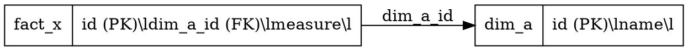

# Graphviz `dot` Usage (Repeatable Diagram Workflow)

This project uses Graphviz to generate schema diagrams from a text source file.

- Source file: `Ekipa12_Naloga2b.dot`
- Generated image: `Ekipa12_Naloga2b.png`

## 1. Prerequisite

Check that `dot` is installed:

```bash
command -v dot
```

If it prints a path (for example `/usr/bin/dot`), you are ready.

## 2. Basic Command Syntax

```bash
dot -T<format> <input.dot> -o <output_file>
```

Common formats:
- `-Tpng` for PNG image
- `-Tsvg` for SVG vector image
- `-Tpdf` for PDF

## 3. Commands Used in This Project

Generate PNG from the current source:

```bash
dot -Tpng naloga2b/Ekipa12_Naloga2b.dot -o naloga2b/Ekipa12_Naloga2b.png
```

Optional SVG output:

```bash
dot -Tsvg naloga2b/Ekipa12_Naloga2b.dot -o naloga2b/Ekipa12_Naloga2b.svg
```

## 4. Repeatable Workflow

1. Edit `naloga2b/Ekipa12_Naloga2b.dot`.
2. Regenerate diagram:

```bash
dot -Tpng naloga2b/Ekipa12_Naloga2b.dot -o naloga2b/Ekipa12_Naloga2b.png
```

3. Verify output file metadata:

```bash
file naloga2b/Ekipa12_Naloga2b.png
```

## 5. Minimal `.dot` Template

Use this as a quick starting point:



Render it:

```bash
dot -Tpng example.dot -o example.png
```

## 6. Notes

- `.dot` is plain text and should be kept in git for readable diffs.
- `.png` is generated output for sharing/viewing.
- When schema changes, update `.dot` first, then regenerate `.png`.

## 7. Color Legend in `Ekipa12_Naloga2b`

Current diagram color semantics:
- Gray: shared dimensions reused by both v1 and v2.
- Orange: v1 path objects (`dim_location`, `fact_accident`, `fact_air_quality_daily`).
- Blue: v2 path objects (new dimensions + v2 facts).

Keep this legend stable unless architecture decisions change in `ARCHITECTURE_DECISIONS.md`.
