# Pregled naloge 6

Ta dokument je kratek slikovni pregled okolja Superset in KPI nadzornih plošč, pripravljenih za nalogo. Služil bo kot osnovna markdown datoteka za kasnejšo pretvorbo v PDF poročilo.

## Okolje Superset

Delo z nadzornimi ploščami je izvedeno v Apache Superset. Superset je neposredno povezan s PostgreSQL podatkovnim skladiščem prek povezave `dw`.

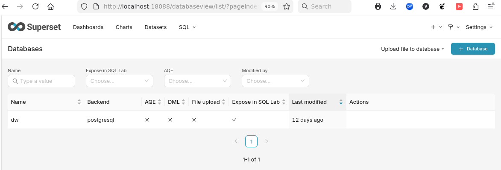

KPI grafikoni uporabljajo virtualne podatkovne množice v Supersetu. Te podatkovne množice temeljijo na SQL datotekah iz `naloga6/sql/`. Tako podatkovno skladišče ostane vir resnice, Superset pa lahko ob izvajanju poizvedb uporabi filtre nadzorne plošče.

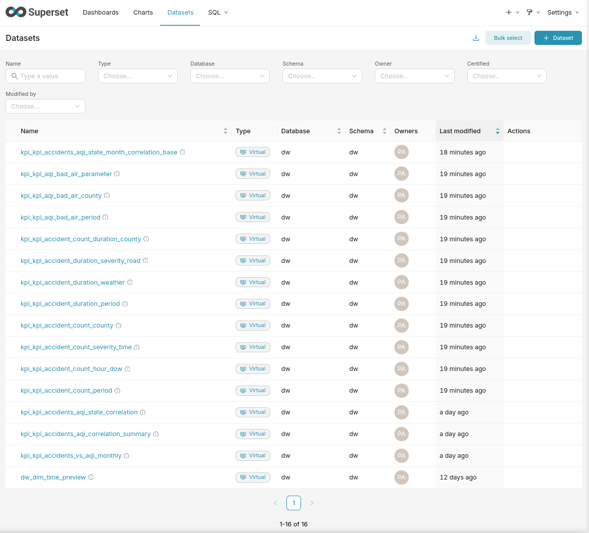

Seznam grafikonov prikazuje ustvarjene KPI grafikone. Vključuje tabelarne predoglede za preverjanje SQL poizvedb in grafične prikaze, uporabljene na nadzornih ploščah.

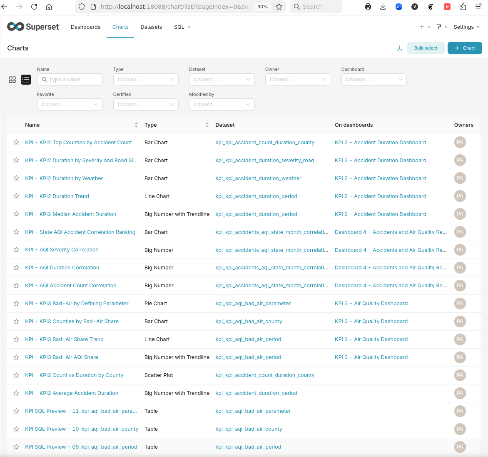

Seznam nadzornih plošč prikazuje objavljene nadzorne plošče za nalogo:

- KPI 1 - Accident Frequency Dashboard
- KPI 2 - Accident Duration Dashboard
- KPI 3 - Air Quality Dashboard
- Dashboard 4 - Accidents and Air Quality Relationship

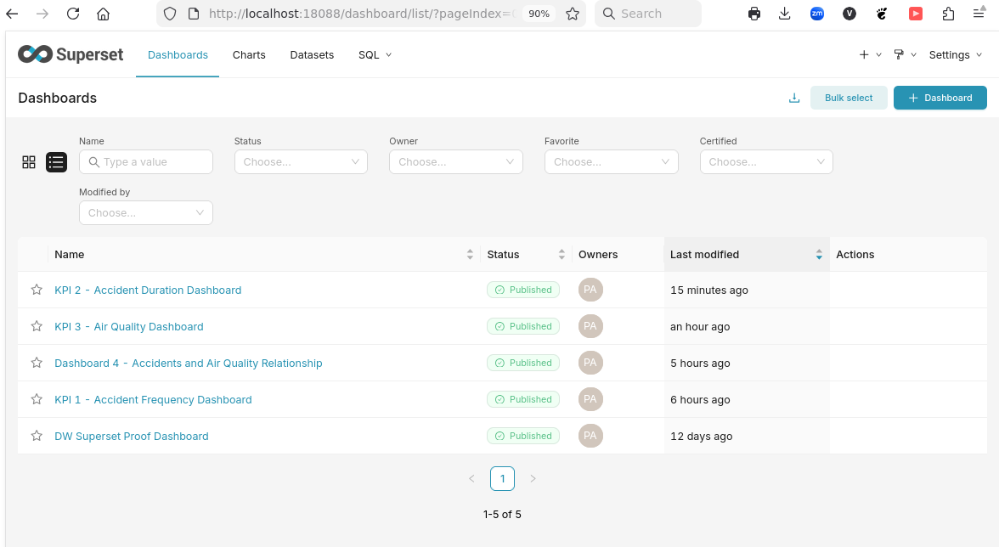

## KPI 1: Pogostost nesreč

Prva nadzorna plošča je osredotočena na število prometnih nesreč. Odgovarja na vprašanje, kdaj in kje so nesreče najpogostejše ter kako se obseg nesreč spreminja glede na resnost.

Nefiltriran pogled prikazuje celoten nabor podatkov o nesrečah. Nadzorna plošča vsebuje:

- KPI kartico z mesečnim številom nesreč in trendom;
- mesečni trend števila nesreč;
- vzorce nesreč po dnevu v tednu in uri;
- število nesreč po resnosti skozi čas;
- najpogostejše okraje po številu nesreč.

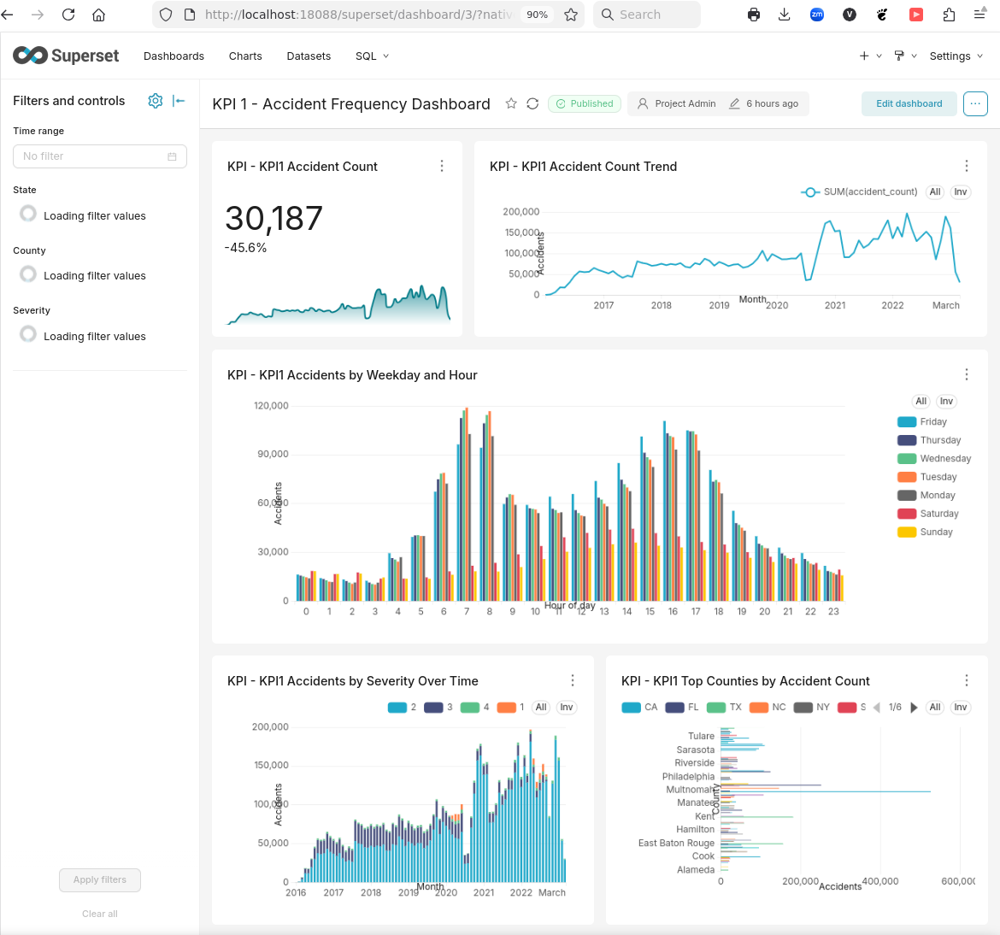

Filtriran pogled prikazuje iste grafikone po uporabi časovnega obsega, izbranih zveznih držav, izbranih okrajev in izbranih stopenj resnosti. Grafikoni se preračunajo iz filtriranih podatkov, zato velika številka, trend, grafikon po dnevu/uri, grafikon resnosti in razvrstitev okrajev opisujejo izbrani kontekst.

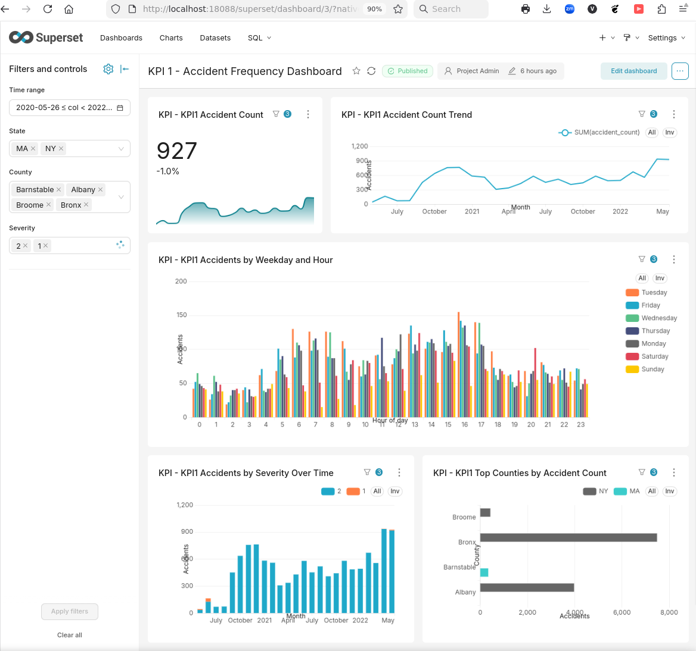

Ta nadzorna plošča je uporabna za iskanje koncentracije nesreč po času in geografiji. Hkrati prikaže, kako filtri zožijo analizo z nacionalne ravni na manjši lokalni kontekst.

## KPI 2: Trajanje nesreč

Druga nadzorna plošča je osredotočena na trajanje nesreč. Pri pregledu se je pokazalo, da povprečno trajanje ni dovolj berljivo, ker nekaj zelo dolgih dogodkov močno vpliva na merilo grafikonov. Zato je bila nadzorna plošča spremenjena tako, da kot glavna vidna merila uporablja mediano trajanja in p90 trajanja. Osamelci ostanejo v podatkih, vendar ne zakrijejo več običajnega vzorca.

Nefiltriran pogled vsebuje:

- KPI kartico za mediano trajanja nesreče;
- mesečni trend z mediano trajanja in p90 trajanjem;
- mediano trajanja po vremenskih pogojih;
- mediano trajanja po resnosti in primarnem cestnem signalu;
- najpogostejše okraje po številu nesreč.

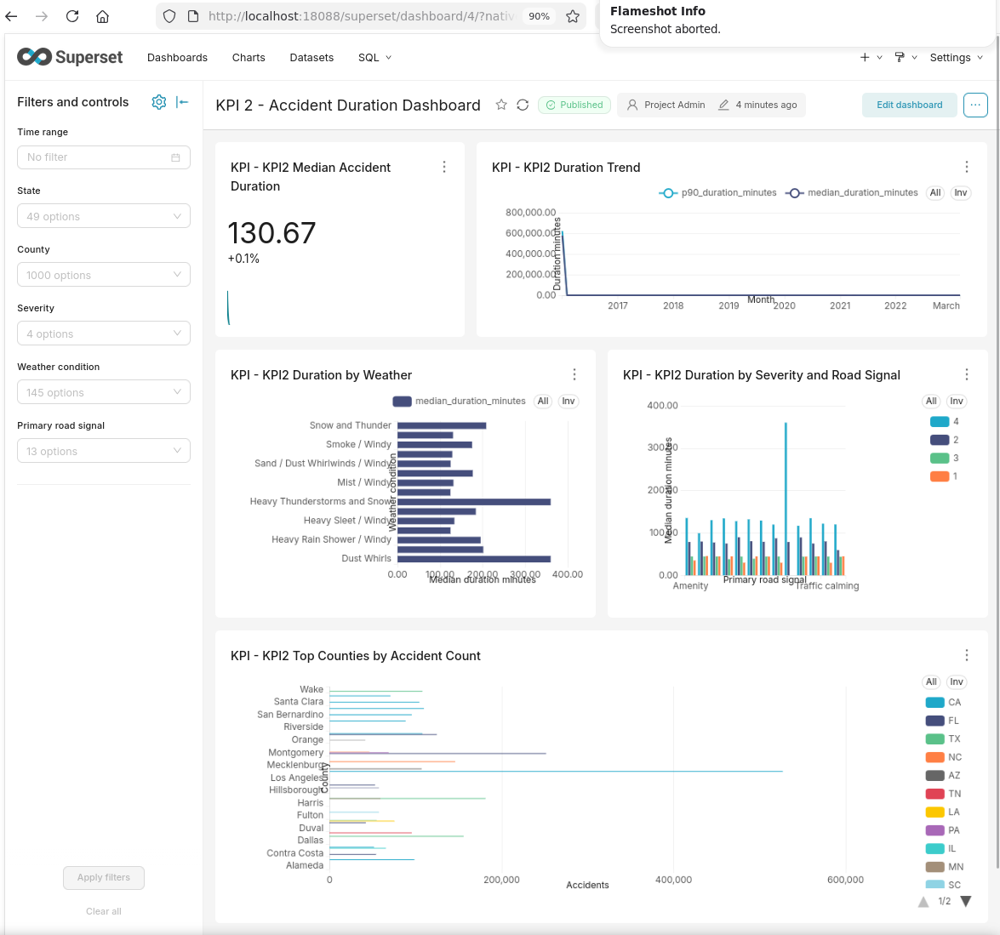

Pogled, filtriran na Kalifornijo, prikazuje, kako se ista nadzorna plošča spremeni po uporabi filtra za zvezno državo. Grafikoni zdaj opisujejo samo Kalifornijo, razvrstitev okrajev pa postane razvrstitev kalifornijskih okrajev.

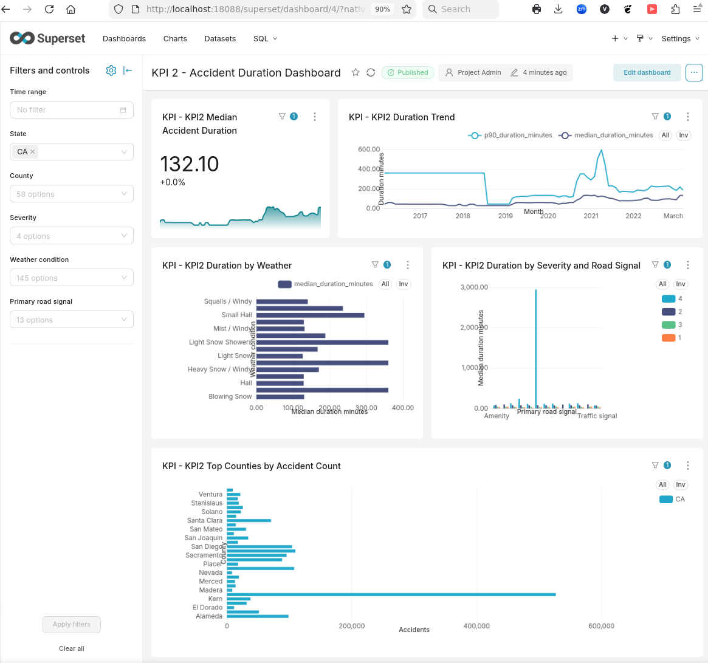

Pogled, filtriran po vremenu, prikazuje usmerjen primer za vremenski pogoj `Tornado`. To je majhen in neobičajen podnabor podatkov. Primer pokaže, da lahko nadzorna plošča pregleda redke pogoje, ne da bi odstranjevala osamelce iz izvornih podatkov.

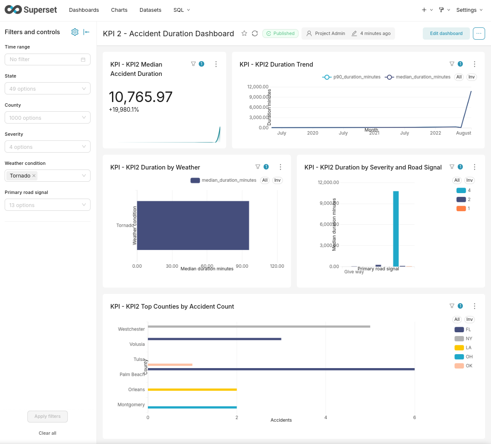

Ta nadzorna plošča je uporabna za primerjavo tipičnega trajanja po vremenu, resnosti, cestnem signalu in geografiji. Kontekst obsega nesreč doda grafikon najpogostejših okrajev.

## KPI 3: Kakovost zraka

Tretja nadzorna plošča je osredotočena na opazovanja AQI s slabim zrakom. Slab zrak je opredeljen kot `AQI > 100`, skladno s predlogom naloge.

Nefiltriran pogled vsebuje:

- KPI kartico za delež AQI opazovanj s slabim zrakom;
- trendni grafikon, ki primerja povprečni AQI in delež slabega zraka;
- okraje, razvrščene po deležu slabega zraka;
- kolobarni grafikon, ki prikazuje, kateri opredeljujoči parameter prispeva k opazovanjem slabega zraka.

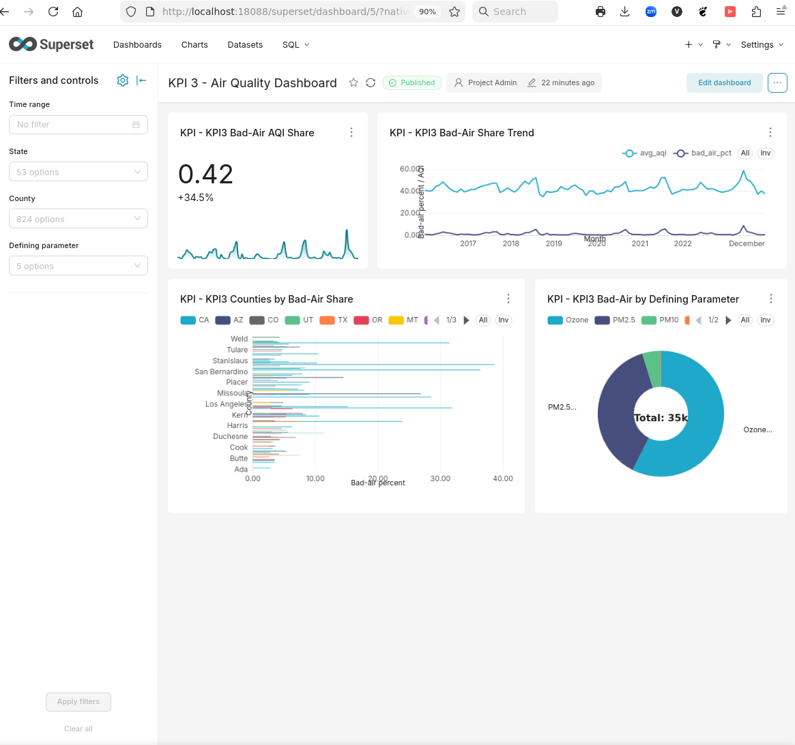

Filtriran pogled prikazuje nadzorno ploščo po uporabi časovnega obsega, filtra za zvezno državo in izbire okrajev. Razvrstitev okrajev in grafikon opredeljujočega parametra zdaj opisujeta samo izbrane okraje v New Yorku in izbrano obdobje.

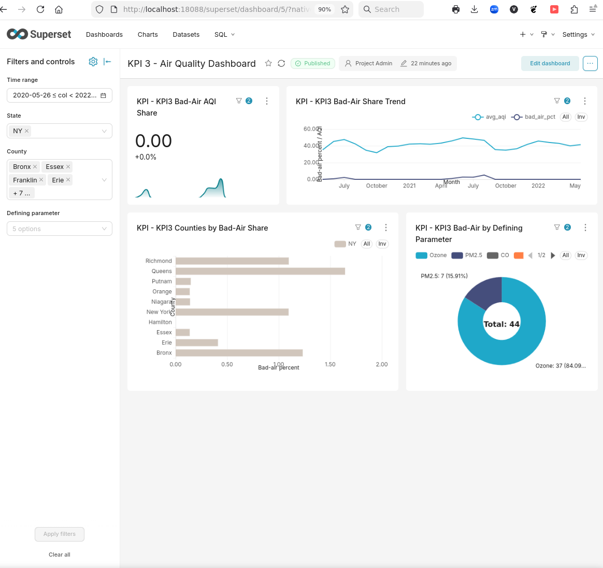

Ta nadzorna plošča je uporabna za pregled, kje se pojavljajo opazovanja slabega zraka in kateri onesnaževalni parameter je najpogosteje odgovoren za ta opazovanja.

## Nadzorna plošča 4: Povezava med nesrečami in kakovostjo zraka

Zadnja nadzorna plošča združuje mere nesreč in kakovosti zraka. Deluje na zrnu zvezna država/mesec in je namenjena analizi povezav, ne dokazovanju vzročnosti.

Nefiltriran pogled prikazuje splošno povezavo med merami nesreč in deležem slabega zraka:

- korelacijo med številom nesreč in deležem slabega zraka;
- korelacijo med povprečnim trajanjem nesreč in deležem slabega zraka;
- korelacijo med deležem hudih nesreč in deležem slabega zraka;
- raztresene grafikone za število nesreč in trajanje glede na delež slabega zraka;
- razvrstitev korelacij po zveznih državah;
- mesečno primerjavo števila nesreč in deleža slabega zraka.

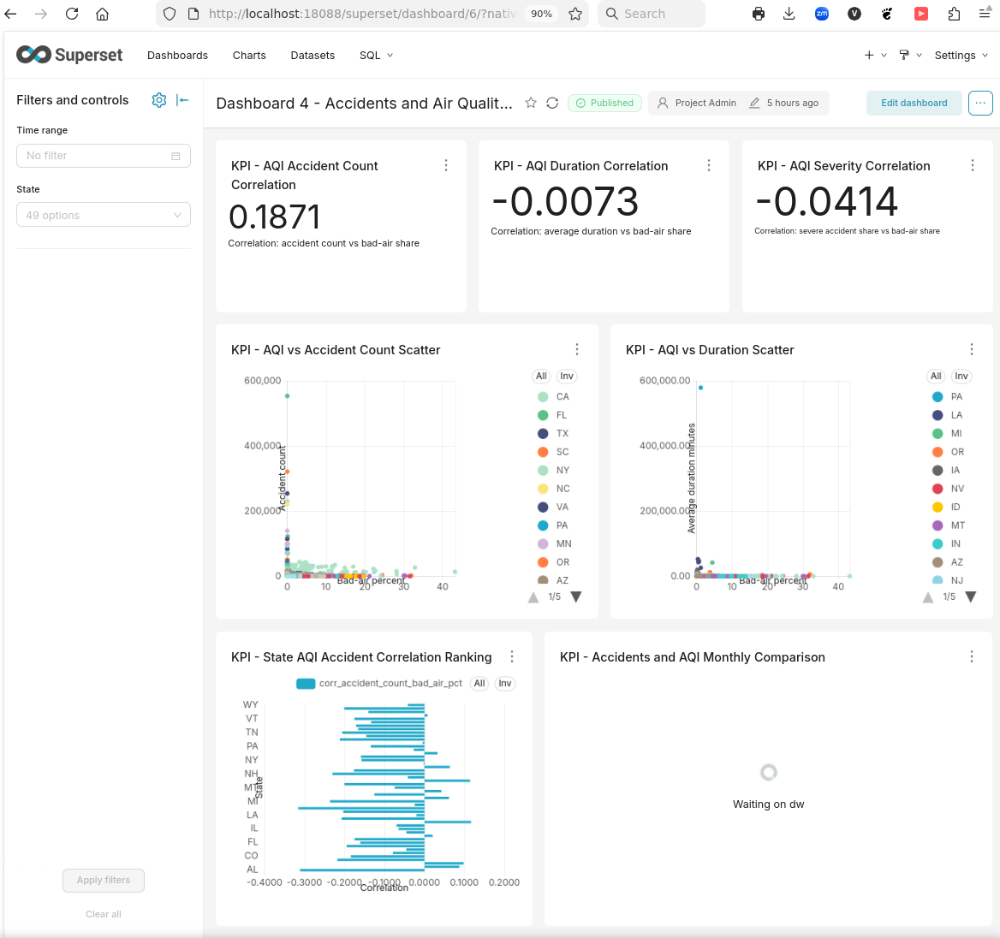

Filtriran pogled uporabi časovni obseg in izbrane zvezne države. Korelacijske kartice in grafikoni se preračunajo iz izbranih opazovanj zvezna država/mesec. V tem primeru izbrane zvezne države kažejo šibke negativne korelacije.

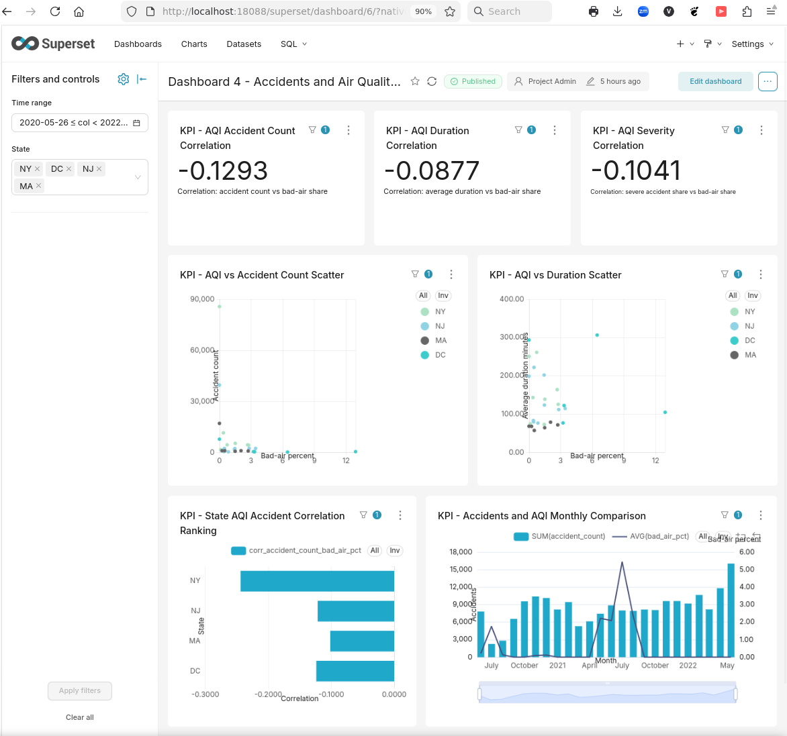

Kombinirano nadzorno ploščo je treba brati previdno. Pozitivna korelacija pomeni, da dve meri navadno rasteta skupaj. Negativna korelacija pomeni, da ena mera navadno raste, druga pa pada. Vrednosti blizu nič pomenijo, da v izbranih podatkih ni močne linearne povezave. Ti grafikoni opisujejo samo povezanost; ne dokazujejo, da kakovost zraka povzroča spremembe v nesrečah.

## Povzetek

Okolje Superset zdaj vsebuje celoten sklop nadzornih plošč za nalogo:

- KPI 1 prikazuje pogostost nesreč.
- KPI 2 prikazuje trajanje nesreč z mediano in p90 trajanjem.
- KPI 3 prikazuje delež AQI opazovanj s slabim zrakom.
- Nadzorna plošča 4 primerja mere nesreč z merami kakovosti zraka.

Vse nadzorne plošče uporabljajo virtualne podatkovne množice, podprte s podatkovnim skladiščem. Filtri in navzkrižno filtriranje so nastavljeni za dimenzije, ki so vidne na grafikonih. Osamelci ostanejo v podatkih, izbire vizualizacij pa so po potrebi prilagojene tako, da nadzorne plošče ostanejo berljive.
